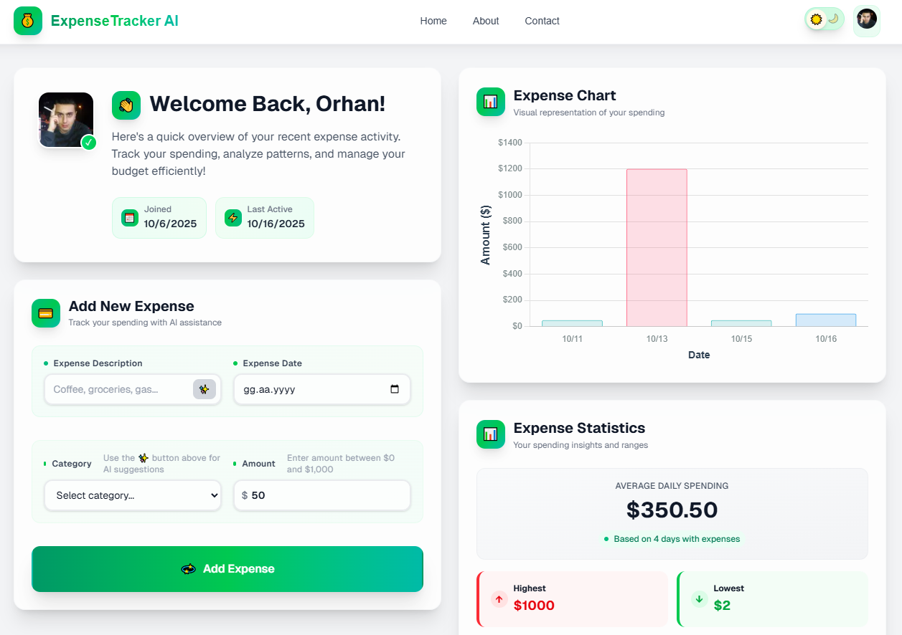
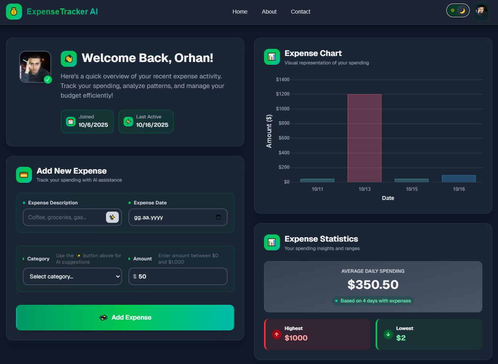
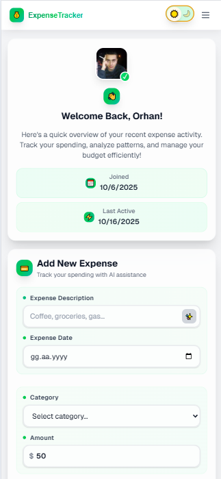

# ExpenseTracker AI

An intelligent, AI-powered application designed for modern personal finance management. Track your expenses, analyze spending patterns, and gain actionable insights with the power of AI.

---

<p align="center">
  <a href="https://expensetrackerai-gamma.vercel.app/" target="_blank">
    
  </a>
</p>

---

### The Problem It Solves

Personal finance management can be overwhelming. Many tools are either too simple, lacking insightful analysis, or too complex for daily use. ExpenseTracker AI bridges this gap by offering a modern, intuitive interface combined with the power of AI. It automates tedious tasks like categorization and provides actionable, personalized insights, transforming raw expense data into a clear path towards financial wellness.

## ✨ Key Features

- **AI-Powered Insights:** Get actionable advice and analysis on your spending habits.
- **Smart Expense Categorization:** AI automatically suggests categories for new expenses based on their description.
- **Interactive Dashboard & Analytics:** Visualize your spending over time with an interactive bar chart and key statistics.
- **Secure Authentication:** User authentication and management handled securely by Clerk.
- **Full CRUD Functionality:** Create, read, update, and delete expense records seamlessly.
- **Responsive & Modern UI:** A polished, mobile-first design built with Tailwind CSS, featuring a seamless dark mode.

## 📸 Screenshots

| Light Mode Dashboard                        | Dark Mode Insights                        | Mobile View                                   |
| ------------------------------------------- | ----------------------------------------- | --------------------------------------------- |
|  |  |  |

## 🛠️ Tech Stack

| Category           | Technology                      |
| ------------------ | ------------------------------- |
| **Framework**      | Next.js 15 (App Router)         |
| **Language**       | TypeScript                      |
| **Styling**        | Tailwind CSS                    |
| **Backend Logic**  | Next.js Server Actions          |
| **ORM**            | Prisma                          |
| **Database**       | PostgreSQL (NeonDB)             |
| **Authentication** | Clerk.js                        |
| **AI Integration** | OpenRouter API (via OpenAI SDK) |
| **Validation**     | Zod                             |
| **Charting**       | Chart.js with `react-chartjs-2` |
| **Linting**        | ESLint                          |

## 🏛️ Architectural Decisions & Best Practices

This project was engineered not just to work, but to be robust, secure, and maintainable, demonstrating key principles of modern web development.

1.  **Server-First Approach with Next.js App Router:**
    The application leverages Server Components for optimal performance. All data fetching and mutations are handled securely on the server using **Server Actions**, simplifying the codebase by co-locating backend logic with the components that use it.

2.  **Robust Multi-Tenancy Security:**
    The application ensures strict data isolation. All database operations in server actions like `deleteRecord.ts` explicitly include a `where: { userId }` clause. This guarantees that a user can **only ever access or modify their own data**.

3.  **End-to-End Type Safety & Server-Side Validation:**
    Leveraging TypeScript, Prisma, and Zod, the application is type-safe from the database schema to the UI. As seen in `addExpenseRecord.ts`, all incoming data is rigorously validated on the server, ensuring database integrity.

4.  **Performance-Oriented Data Fetching:**
    The main dashboard requires multiple data points. In `getUserRecord.ts`, these distinct database queries are executed concurrently using `Promise.all`. This parallelization **minimizes server response times** and improves the initial page load experience.

5.  **Polished & Performant User Experience (UX):**
    - **Responsive UI with Pending States:** Actions like deleting a record provide immediate visual feedback (e.g., loading spinners), clearly communicating system status.
    - **Comprehensive State Handling:** The UI meticulously handles loading (with skeleton loaders), error, and empty states across all data-driven components.
    - **FOUC Prevention:** A critical inline script in `RootLayout.tsx` sets the theme _before_ the page renders, completely eliminating the jarring "Flash of Unstyled Content".

## 🧠 A Deeper Look at the AI Integration

The "AI" in ExpenseTracker AI is more than a buzzword; it's a carefully implemented feature focusing on utility, reliability, and cost-effectiveness.

- **Cost-Effective Model Selection:** The AI integration leverages **OpenRouter** to access high-performance yet free-to-use models. This demonstrates an understanding of managing LLM costs in a real-world scenario, prioritizing efficiency without sacrificing quality.
- **Structured Output via Prompt Engineering:** Prompts, especially for generating insights in `getAIInsights.ts`, are meticulously engineered to request **structured JSON** output. This ensures predictable, parsable responses from the LLM, making the integration robust and preventing runtime errors.
- **Graceful Fallbacks:** The system is designed for resilience. If the AI service is unavailable or fails, as seen in `getAIInsights.ts`, the application gracefully falls back to a default state, ensuring the user experience is never broken.

## 🚀 Getting Started

To run this project locally, follow these steps:

1.  **Clone the repository:**

    ```bash
    git clone https://github.com/lodra24/expensetrackerai.git
    cd expensetracker-ai
    ```

2.  **Install dependencies:**

    ```bash
    npm install
    ```

3.  **Set up environment variables:**
    Create a `.env` file by copying `.env.example`. Fill in the required API keys.

    ```bash
    cp .env.example .env
    ```

4.  **Sync database schema:**

    ```bash
    npx prisma db push
    ```

5.  **Run the development server:**
    ```bash
    npm run dev
    ```
    The application will be available at `http://localhost:3000`.

## 🧪 Testing

- **Linting:** The project is configured with ESLint to enforce consistent coding standards (`npm run lint`).
- **Architectural Resilience:** While this project does not yet have a dedicated test suite, the server-first architecture with strong typing and server-side validation inherently reduces a significant class of bugs. Critical server actions are rigorously validated with Zod, acting as a first line of defense for data integrity.
- **Future Work:** The roadmap includes implementing unit tests with Jest and end-to-end tests with Playwright.

## 📄 License

This project is licensed under the MIT License. See the [LICENSE](LICENSE) file for details.
